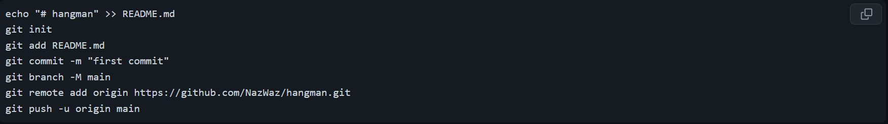

# Hangman

The project consists of a tool that allows the user to play the popular word guessing game, Hangman. It was built using Python in VS Code and required me to learn and understand the basic fundamentals of Python as well as proper coding practices such as the use of GitHub and this documentation to record all changes and what I have learnt throughout the process.

# Milestone 1

- The first step was to set up the dev environment and ensure that the files were being backed up using Github.    

# GITHUB

- The first line of the code was to create this actual md file using `echo "# hangman" >> README.md`. Then using `git init`, the connection between the code on my PC and my github was initialised, after also including my email and username. The md file was then staged using the `git add` command and once this was staged, it was ready to be committed using the `git commit -m` command. Though I used this initially for commits, I learnt to also use the source control tab to quickly stage and commit changes. 

- The `git branch -M main` command allowed me to rename the master (main) branch to main for clarity and I learnt to make additional branches using the `git checkout -b` command followed by the branch name. This was important to learn as all future changes to the code needed to be kept away from the main branch of code until it was checked making it easy to identify changes and errors. 

- After changes were made on any branches, I had to use `git checkout main` to return to the main branch and merge the new branch back to the main branch using `git merge` followed by the new branch name. I could constantly check which branch I was on as well as the staged changes using `git status`. Once merged, I could upload the changes to the main branch to Github using `git push -u origin main` however i first used the command `git remote add origin` once to ensure that all the changes were going through correctly to the repository.

# Miniconda

- After installing miniconda, the dev environment in VS code had to be set up properly. First, the version was checked to see if it was installed or up to date using `conda --version`. Then it was initialised using `conda init` and to ensure it was initialised in the correct state on startup and using bash, `conda init bash` was used. To begin setting up the environment, I used `conda create -n hangman` to create a new environment called hangman and after agreeing to the set up I was able to use `conda activate` to complete the set up.

- I could check the library of the environment to see what was installed using `conda list` and the aim was to install pip to this environment, to easily install even more libraries. `which pip` allowed me to check the path of the pip in use and since the current hangman environment was missing pip, `conda install pip` was used to install it here. Finally, `pip install` was used to install any essential libraries, so I used `pip install ipykernel`.

# Milestone 2

- 
- 
- 
- 
