# Hangman

The project consists of a tool that allows the user to play the popular word guessing game, Hangman. It was built using Python in VS Code and required me to learn and understand the basic fundamentals of Python as well as proper coding practices such as the use of GitHub and this documentation to record all changes and what I have learnt throughout the process.

# Milestone 1

The first step was to set up the dev environment and ensure that the files were being backed up using Github.    

# Github

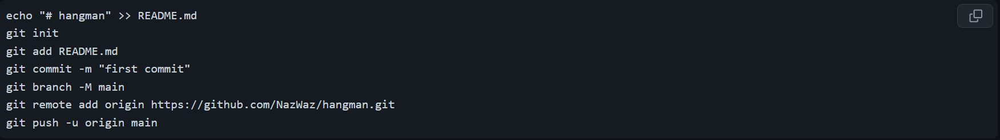

- The first line of the code was to create this actual md file using `echo "# hangman" >> README.md`. Then using `git init`, the connection between the code on my PC and my github was initialised, after also including my email and username. The md file was then staged using the `git add` command and once this was staged, it was ready to be committed using the `git commit -m` command. Though I used this initially for commits, I learnt to also use the source control tab to quickly stage and commit changes. 

- The `git branch -M main` command allowed me to rename the master (main) branch to main for clarity and I learnt to make additional branches using the `git checkout -b` command followed by the branch name. This was important to learn as all future changes to the code needed to be kept away from the main branch of code until it was checked making it easy to identify changes and errors. 

- After changes were made on any branches, I had to use `git checkout main` to return to the main branch and merge the new branch back to the main branch using `git merge` followed by the new branch name. I could constantly check which branch I was on as well as the staged changes using `git status`. Once merged, I could upload the changes to the main branch to Github using `git push -u origin main` however i first used the command `git remote add origin` once to ensure that all the changes were going through correctly to the repository.

# Miniconda

- After installing miniconda, the dev environment in VS Code had to be set up properly. First, the version was checked to see if it was installed or up to date using `conda --version`. Then it was initialised using `conda init` and to ensure it was initialised in the correct state on startup and using bash, `conda init bash` was used. To begin setting up the environment, I used `conda create -n hangman` to create a new environment called hangman and after agreeing to the set up I was able to use `conda activate` to complete the set up.

- I could check the library of the environment to see what was installed using `conda list` and the aim was to install pip to this environment, to easily install even more libraries. `which pip` allowed me to check the path of the pip in use and since the current hangman environment was missing pip, `conda install pip` was used to install it here. Finally, `pip install` was used to install any essential libraries, so I used `pip install ipykernel`.

# Milestone 2

The second milestone involved creating the variables for the game. 

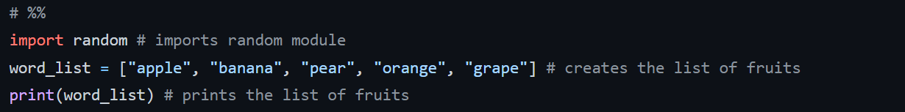

- My first task here was to create a list of random fruits. I named the list `word_list` and assigned values inside using an `=` and a pair of square brackets `[]`. For the list, each fruit had to be put inside quotation marks `" "` so they would be recognised as strings, their data type. Each fruit's name was seperated by a comma `,` and once the list was created it could then be output using the `print()` function. Here `print(word_list)` outputs the list of fruits I created.

- The first line of code was important as a hashtag `#` is used to indicate that it is not part of the code and is instead a comment. However, in VS Code specifically, the `# %%` has a special feature where it creates a magic cell. Essentially this allows the block of code following it to be run independently instead of running the full code, making the process much easier. Of course comments were added to the code also to help keep track.

- The second line of code was also important for later. Though it was not used in this block with the list, the `import` statement was used to import one of Python's built-in modules, the random module.

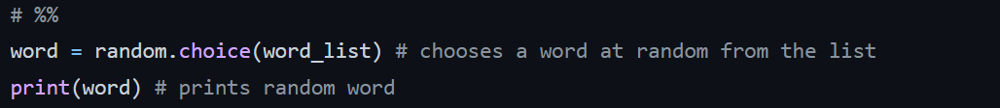

- This next block of code was used to choose a random word from the list of fruits I created. This was done by using the function `random.choice()` with the list `word_list` and assigning it to the variable called `word`. Then this word was printed using `print(word)` and this cell was ran by pressing Shift + Enter together and checked by seeing whether the output would give random words from the list more than once.

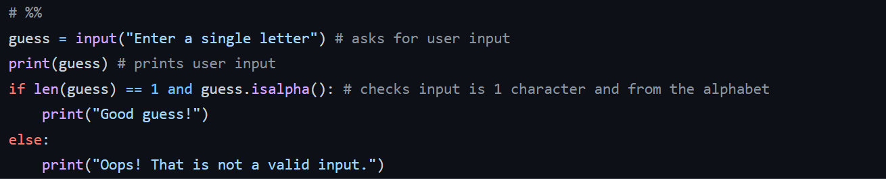

- The final block of code allowed the user to input a single letter as a guess. `input()` is used with a message `"Enter a single letter"` and assigned to the variable `guess` to give the user a prompt when the code is run, to enter their guess. This guess was also printed.

- An if-else loop was used to check the validity of the guess, that it was both a single character and from the alphabet. The code began with `if` and then the conditions followed. The length was checked using `len()` function and `.isalpha()` was used to check that the character is an actual letter. After these 2 conditions, a colon was used and the indented code was what happens should both conditions be true. In this case, if the guess was a single letter, the message `"Good guess!"` would be output to the user.

- The `else` statement provided the alternative outcome, should the `if` condition not be fulfilled. So if the character was more than 1 or a number for example, a different message would be printed: `"Oops! That is not a valid input."`.

# Milestone 3

The third milestone involved using what was learnt previously to set up functions to both ask for a user input, check the guess is valid and then return a response telling the user whether or not the guessed letter is in the random word.

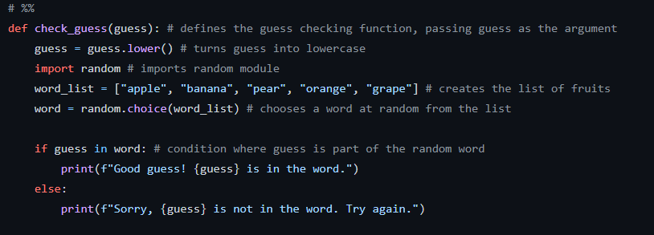

- The process of checking the guesses to see whether it was part of the random word was assigned the function `check_guess(guess)` with the argument as the guess variable. In this block of code, the 3rd line uses `guess.lower` to turn the guess into a lower case letter. The following code is taken from the previous milestone and was used to create the list of fruits and pick a word at random.

- An if statement was inserted at the end as part of the function, with the condition that `guess in word` meaning that the variable guess would be part of the word variable. In the case that this condition is true, a message is output to the user informing them the guess is part of the word and the outcome if the condition is false i.e. the letter is not part of the word, informs the user that their guess is not part of the word.

- The printed messages in the if statement used f-strings to format the message with the guess variable. This was done by adding an `f` before the string inside the `()` brackets following print along with `{guess}` in place of where the guessed letter would go. This meant that whatever the user guessed would automatically be added into the messages output back to the user. 

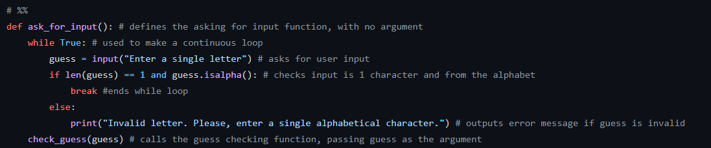

- The process of asking the user for the actual input and checking it was assigned the function `ask_for_input` and only needed `()` with no argument neccessary. In this block of code, a while loop was used to ensure the code ran continuously. This was important as the user needed to be able to input another value if their initial input did not pass the desired check. The while loop had the condition set to True to achieve this result.

- Using an if statement in the while loop allowed me to set up 2 outcomes in different conditions. If the guess was exactly 1 character and from the alphabet, the `break` commmand would end this loop and break out of it. If this condition was not acheived, the else outcome was outputting an error message for the user.

- Finally, `check_guess(guess)` is used to call upon the `check_guess` function we defined earlier to run and actually check to see if the guess is included in the random word.

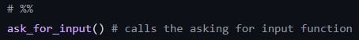

- This last line of code is simply `ask_for_input()` to call upon the `ask_for_input` function as a whole and was used to test the code was working also.

# Milestone 4

The fourth milestone took everything learnt up until now and compiled everything into a class. Creating a class required setting up the functions as methods and variables as attributes within the class as a way to have the base code of checking for guesses and asking for inputs altogether so it can be called upon to create an instance. This would save having to repeat the same lines of code constantly.

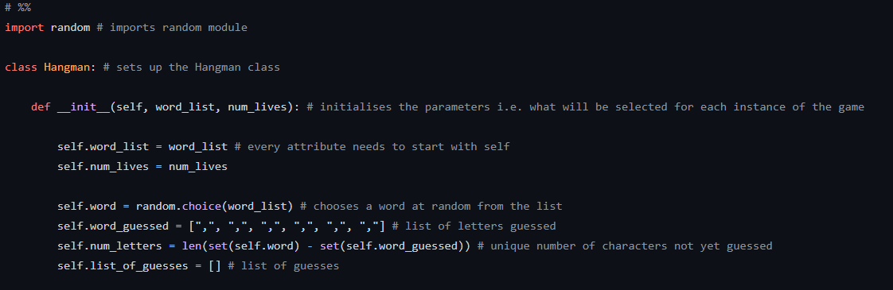

- Before setting up the class, any imports were carried out, so the random module was imported. 

- The class itself was set up using the name Hangman with `class Hangman:` and the attributes which were to be used as parameters were initialised and passed using the `def __init__()`function, with self as the first argument. The second and third arguments were the chosen parameters being the list of words `word_list` and the number of lives `num_lives`. These could be input into this class outside of the class for a different instance.

- They were then, along with every attribute, given a `self.` prefix and this allowed all of these variables to be used later in the methods. The other attributes listed here were the random word needing to be guessed `self.word`, the list of letters guessed in the random word `self.word_guessed`, the unique number of characters left to guess `self.num_letters` and finally the list of guesses itself `self.list_guesses`. The list of letters guessed was given values as commas which would later be replaced by the correct letters guessed while the list of guesses was left empty and would be filled with every guess. The unique characters left to guess was calculated using the `len()` function along with the `set()` function. Together, the number unique characters in the random word string was found as well as the number of unique chracters in the characters of the word guessed string. This difference gave the number of unique characters left to guess.

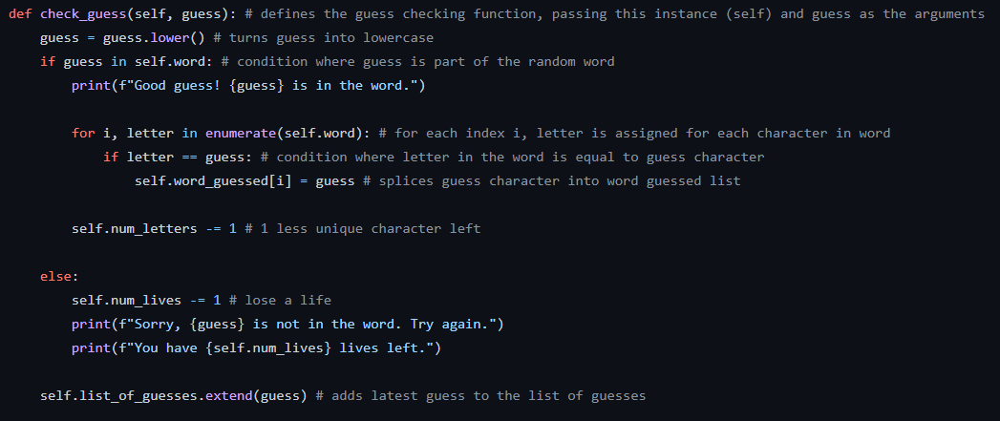

- The first function to set up as a method was `check_guess(self, guess)` where now self needed to be the first argument and guess was the second passed through. 

- The `.lower()` function was used to make the users guess into lower case. Then an `if` statement was used to check whether the guess was in the word or not and a for loop was used if the guess was in the word.

- The `for` loop was used to go through every character in the `self.word` string through multiple iterations, using `i` as the index and letter as each individual character. Using `enumerate()` i was able to go through every letter and assign it to `letter`. Then another `if` loop was used to check if each letter was equal to the `guess` letter and if it was equal, the word guessed list would be updated using `self.word_guessed[i]` and equalling it to `guess`. Since `i` is the index of the random word, it would also be the index in the list of characters needing to be replaced for the guessed word.

- Finally, outside of the `for` loop but still within the `if` loop, the number of unique characters was reduced by 1 using `self.num_letter -= 1`. As the guess would be correct in this situation, there would naturally be 1 less unique character left in the word to guess.

- The `else` statement was used if the guess was not in the word. The lives of the user would have to be reduced by 1 using `self.num_lives -= 1` and a message indicating the updated lives would be printed also.

- Outisde of both the `if` and `else` statements, the latest guess was added to the list using `self.list_of_guesses.extend(guess)`. It was outside because the list would have to be updated in both situations as a guess would have been made. The `.extend()` function was used because it adds in the character as another element to the empty list of guesses at the end.

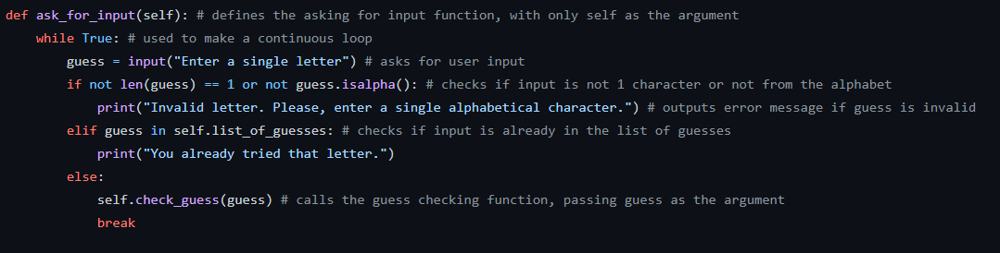

- The second function to set up as another method was `ask_for_input(self)` where instead of no argument, self had to be passed. 

- The same `while True:` loop was used to create a continuous loop however this time, the first `if` condition was checking if the input was incorrect i.e. it was not 1 character or from the alphabet. Using the `not` operator with the previous code, I was able to flip the boolean for both `len(guess)` and `guess.isalpha()`. Normally this condition would work if these were both true, but using `not` and `or`, I was able to activate this condition should either be false and this would print the error message.

- `elif` was used instead of just else, to provide multiple conditions. This second condition was if the guess had already been guessed before i.e. it was in the list of guesses. Again this could be checked using the `in` operator. This would result in a different message being printed.

- Lastly, for the `else` condition, the guess checking function was passed using `self.check_guess(guess)`, where only guess is needed as the argument however `self.` is used as a prefix as the instance of the method. A break is added at the end of this method to allow the loop to end after a successful guess.

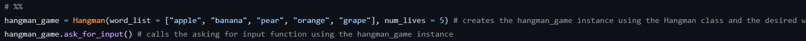

- In a seperate magic cell, the code to test and use the class was written. The instance `hangman_game` was created using the `Hangman()` class as well as the word list and number of lives passed as the parameters. Then this could be used with the ask for input function as `hangman_game.ask_for_input()` with the instance I just created as the instance used to call the method.

# Milestone 5

The fifth and final milestone was used to create the full game itself.

-

-

-

-

-